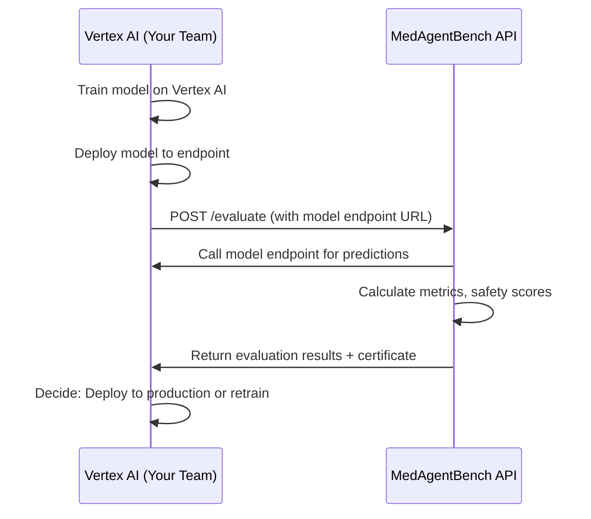

# MedAgentBench API - Integration Package for Vertex AI Team

## 🎯 Purpose
This API exposes **MedAgentBench** (model evaluation agent) as a REST service. Your Vertex AI team can call this API to evaluate trained models.

---

## 📦 What's Included

```
agents/agent_3_benchmark/
├── api.py                  # FastAPI server (main API)
├── api_client.py           # Python client library
├── api_requirements.txt    # Dependencies
├── API_GUIDE.md           # Complete documentation
├── agent.py               # Core evaluation agent
├── config.py              # Configuration
├── thresholds.py          # Evaluation thresholds
├── graph/                 # LangGraph workflow
├── nodes/                 # Workflow nodes
└── tools/                 # Evaluation tools
```

---

## 🚀 Quick Start

### 1. Install Dependencies
```bash
pip install -r api_requirements.txt
```

### 2. Start the API Server
```bash
uvicorn agents.agent_3_benchmark.api:app --host 0.0.0.0 --port 8001
```

### 3. Access API
- **Base URL**: `http://localhost:8001`
- **Swagger Docs**: `http://localhost:8001/docs`
- **OpenAPI Spec**: `http://localhost:8001/openapi.json`

---

## 🔗 Integration with Vertex AI

### Workflow: Train → Evaluate → Deploy



---

## 📡 Key API Endpoints for Integration

### 1. Start Evaluation
```http
POST /evaluate
Content-Type: application/json

{
  "test_data_path": "gs://your-bucket/test-data.jsonl",
  "model_endpoint_url": "https://your-vertex-endpoint.googleapis.com/predict",
  "model_endpoint_type": "vertex_ai",
  "model_name": "medical-model-v1",
  "max_test_cases": 100
}
```

**Response:**
```json
{
  "evaluation_id": "eval_20251127_180000",
  "status": "running",
  "message": "Evaluation started successfully",
  "started_at": "2025-11-27T18:00:00"
}
```

---

### 2. Check Status (Polling)
```http
GET /status/{evaluation_id}
```

**Response:**
```json
{
  "evaluation_id": "eval_20251127_180000",
  "status": "running",  // or "completed" or "failed"
  "progress": "Running evaluation...",
  "started_at": "2025-11-27T18:00:00",
  "completed_at": null
}
```

---

### 3. Get Results
```http
GET /results/{evaluation_id}
```

**Response:**
```json
{
  "evaluation_id": "eval_20251127_180000",
  "model_name": "medical-model-v1",
  "evaluation_status": "PASS",
  "metrics": {
    "accuracy": 0.92,
    "precision": 0.89,
    "recall": 0.91,
    "f1_score": 0.90
  },
  "safety_score": 0.95,
  "total_test_cases": 100,
  "successful_predictions": 92,
  "failed_predictions": 8,
  "certificate_path": "reports/certificates/cert_eval_20251127_180000.pdf",
  "timestamp": "2025-11-27T18:05:00"
}
```

---

### 4. Download Certificate
```http
GET /certificate/{evaluation_id}
```

Returns: PDF file with evaluation certificate

---

## 🔧 Python Integration Example

### Option 1: Using Our Client Library
```python
from agents.agent_3_benchmark.api_client import MedAgentBenchClient

# Initialize client
client = MedAgentBenchClient("http://medagentbench-api:8001")

# Start evaluation after Vertex AI training
eval_id = client.start_evaluation(
    test_data_path="gs://medai-data/test/benchmark.jsonl",
    model_endpoint_url="https://your-vertex-endpoint/predict",
    model_endpoint_type="vertex_ai",
    model_name="medical-model-v1"
)

# Wait for completion
client.wait_for_completion(eval_id, poll_interval=10)

# Get results
results = client.get_results(eval_id)

if results['evaluation_status'] == 'PASS':
    print("✅ Model passed evaluation - ready for deployment")
    # Download certificate
    client.download_certificate(eval_id, f"cert_{eval_id}.pdf")
else:
    print("❌ Model failed evaluation - needs retraining")
```

---

### Option 2: Using Standard Requests
```python
import requests
import time

BASE_URL = "http://medagentbench-api:8001"

# 1. Start evaluation
response = requests.post(f"{BASE_URL}/evaluate", json={
    "test_data_path": "gs://medai-data/test/benchmark.jsonl",
    "model_endpoint_url": "https://your-vertex-endpoint/predict",
    "model_endpoint_type": "vertex_ai",
    "model_name": "medical-model-v1"
})
eval_id = response.json()["evaluation_id"]

# 2. Poll for completion
while True:
    status_resp = requests.get(f"{BASE_URL}/status/{eval_id}")
    status = status_resp.json()["status"]
    
    if status in ["completed", "failed"]:
        break
    time.sleep(10)

# 3. Get results
results = requests.get(f"{BASE_URL}/results/{eval_id}").json()
print(f"Evaluation: {results['evaluation_status']}")
print(f"F1 Score: {results['metrics']['f1_score']:.3f}")
```

---

## 📋 Test Data Format

MedAgentBench expects test data in **JSONL** format:

```jsonl
{"case_id": "case_001", "input": {"patient_age": 65, "symptoms": ["fever", "cough"], "vitals": {"temperature": 38.5}}, "expected_output": "pneumonia", "category": "respiratory"}
{"case_id": "case_002", "input": {"patient_age": 45, "symptoms": ["chest_pain"], "vitals": {"bp": "140/90"}}, "expected_output": "hypertension", "category": "cardiovascular"}
```

**Required fields:**
- `case_id`: Unique identifier
- `input`: Patient data (your model receives this)
- `expected_output`: Ground truth diagnosis/prediction
- `category`: Medical category (optional)

---

## 🔒 Model Endpoint Requirements

Your Vertex AI endpoint must accept:

**Request:**
```http
POST /predict
Content-Type: application/json

{
  "patient_age": 65,
  "symptoms": ["fever", "cough"],
  "vitals": {"temperature": 38.5}
}
```

**Response:**
```json
{
  "prediction": "pneumonia",
  "confidence": 0.92
}
```

---

## 🌐 Deployment Options

### Option 1: Local Testing
```bash
uvicorn agents.agent_3_benchmark.api:app --host 0.0.0.0 --port 8001
```

### Option 2: Docker
```dockerfile
FROM python:3.9-slim

WORKDIR /app
COPY agents/agent_3_benchmark /app/agents/agent_3_benchmark
COPY requirements.txt /app/

RUN pip install -r requirements.txt

CMD ["uvicorn", "agents.agent_3_benchmark.api:app", "--host", "0.0.0.0", "--port", "8001"]
```

```bash
docker build -t medagentbench-api .
docker run -p 8001:8001 medagentbench-api
```

### Option 3: Google Cloud Run
```bash
gcloud run deploy medagentbench-api \
  --source . \
  --platform managed \
  --region us-central1 \
  --allow-unauthenticated
```

---

## 🔗 Agent-to-Agent Communication

When you build **MedAgentGym** (training agent), you can call MedAgentBench like this:

```python
# After training completes in Vertex AI
import requests

# Call MedAgentBench to evaluate the newly trained model
response = requests.post("http://medagentbench-api:8001/evaluate", json={
    "test_data_path": "gs://training-data/test.jsonl",
    "model_endpoint_url": vertex_endpoint_url,  # Your trained model
    "model_name": f"model-{training_job_id}",
    "model_endpoint_type": "vertex_ai"
})

evaluation_id = response.json()["evaluation_id"]

# Store evaluation_id for later retrieval
```

---

## 📊 Evaluation Metrics Provided

- **Accuracy**: Overall correctness
- **Precision**: True positives / (True positives + False positives)
- **Recall**: True positives / (True positives + False negatives)
- **F1 Score**: Harmonic mean of precision and recall
- **Safety Score**: Medical safety assessment (0-1)
- **Hallucination Score**: Confidence calibration (0-1)

**Pass/Fail Thresholds** (customizable):
- Minimum accuracy: 0.70
- Minimum F1 score: 0.70
- Minimum safety score: 0.85

---

## 🛠️ Configuration

Update configuration via API:

```http
POST /config
Content-Type: application/json

{
  "model_endpoint_url": "https://default-endpoint.googleapis.com",
  "max_test_cases": 500
}
```

---

## 📞 Support & Questions

**Contact**: [Your contact info]

**Documentation**: See `API_GUIDE.md` for complete reference

**OpenAPI Spec**: Available at `/openapi.json` or in `openapi.json` file

---

## ✅ Testing Checklist for Your Team

- [ ] Install dependencies
- [ ] Start API server
- [ ] Access Swagger UI at `/docs`
- [ ] Test `/health` endpoint
- [ ] Prepare test JSONL data
- [ ] Deploy a test model to Vertex AI
- [ ] Call `/evaluate` with your model endpoint
- [ ] Poll `/status` until completion
- [ ] Retrieve `/results`
- [ ] Download `/certificate`
- [ ] Integrate into your training pipeline

---

**Ready to integrate! Share this entire `agent_3_benchmark` folder with your teammate.** 🚀
